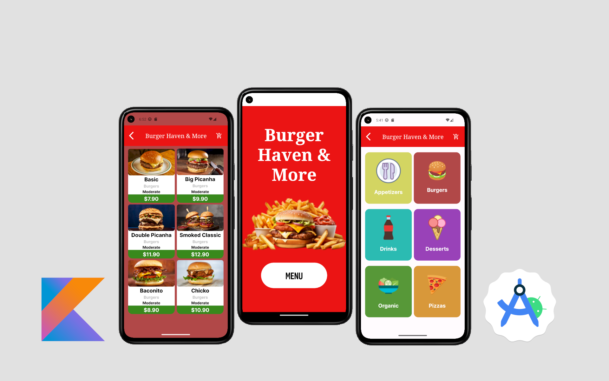

# Burger Haven & More

A restaurant menu app.



<!--  -->

## Summary

- [Overview](#overview)
- [Features](#features)
- [Prerequisites](#prerequisites)
- [Installation](#installation)
- [Usage](#usage)
- [Testing](#testing)
- [Technologies Used](#technologies-used)
- [Contributing](#contributing)
- [License](#license)

## Overview

In a restaurant, you need to quickly take orders, calculate the total for each, and estimate the time each item will take to reach the customers. With this app, all of that is possible.

## Features

- **Digital Menu**: View the complete menu with dish names, prices, and images.
- **Online Orders**: Allows users to place orders directly through the app to be delivered by the waitstaff.
- **Online Payments**: Real-time pricing and in-app payment.

## Prerequisites

Before installing, make sure you have the following prerequisites:

- [Kotlin](https://kotlinlang.org/)
- [Gradle](https://gradle.org/)
- [Java Development Kit (JDK)](https://www.oracle.com/java/technologies/javase-downloads.html)
- [Android Studio](https://developer.android.com/studio) (recommended)

## Installation

Step-by-step instructions to install the application locally.

```sh
# Clone the repository
git clone https://github.com/your-username/your-repository.git

# Navigate to the project directory
cd your-repository

# Build the project
./gradlew build
```

## Technologies Used

- Kotlin
- Android Studio

## License
This project is licensed under the MIT License - see the LICENSE file for details.